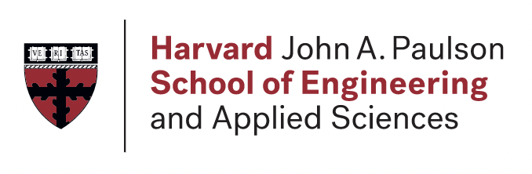

## About Me

 <ul>
    
  <li>Currently pursing a master's in data science at Harvard University</li>
  <li>Also, cross registered at MIT studying quantitative finance</li>
  <li>Interested in Computer Science, Math, and Machine Learning</li>
 </ul>
  
   

## Links

## Stats

 

   

